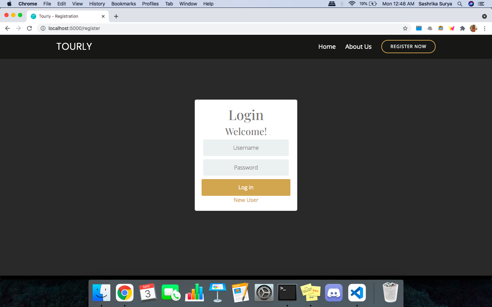

# Tourly

An intelligent tourist system designed to give personalized tourist spot recommendations.

This project was undertaken for course 18CSC206J.

## What is Tourly?

Tourly is a website designed to give the user tourist spot recommendations based on their personal interest.

We collect information throught a 'preference' form and then give you recommendated spots!

## APIs used

- [OpenTripMap](https://opentripmap.io/product): This API is used to get recommendations for tourist places. 
- [Mapbox](https://www.mapbox.com/): This API has been used to embed map in the website and provide navigation.

## Usage guidelines

- Clone the repository by pasting the following command in terminal
```
git clone https://github.com/sashrika15/tourly.git
```
- Change directory to /tourly
```
cd tourly
```
- Install requirements
```
pip install -r requirements.txt
```
- Run main file
```
python main.py
```
- Open any web browser and paste the following
```
localhost:5000
```
## Demo
- Home


- About


- Login


- New User


- Profile


- Preference


- Dashboard


- Map


## To-do

- [ ] Add decription for tourist spots
- [ ] Add navigation for the recommended tourist spots

## Queries

- Please open an issue if there are any problems.

